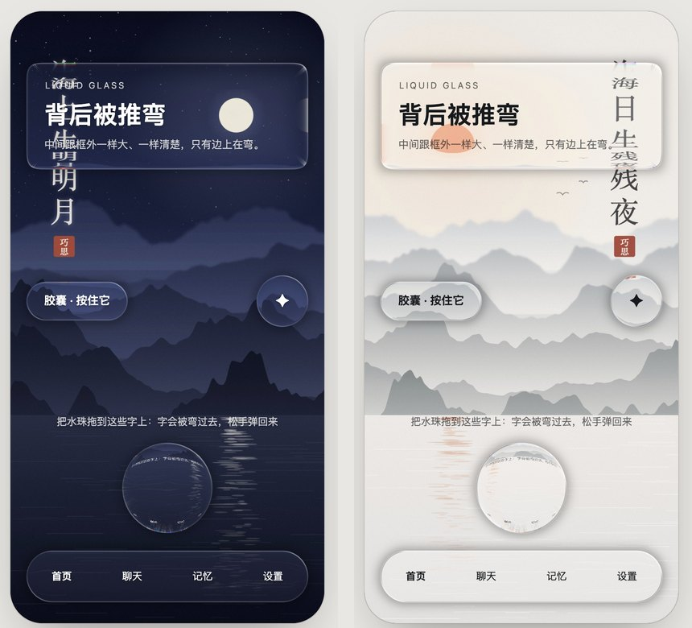

# 液态玻璃

一块 WebGL2 画布，把页面上标了 `data-glass` 的元素画成液态玻璃：背后的东西在玻璃边上被推弯、聚拢、带一点分色，拖着会拉长，松手会弹回。



一个文件，没有依赖，不用 three.js。

## ⚠ 它是实时算的

这不是一张贴图，也不是 CSS 滤镜。每一块玻璃的每一个像素，都由显卡现算折射、色散、高光和接地影。

| | |
|---|---|
| 什么时候算 | 有东西在动（滚动、拖动、按下、换页、改参数）的那几帧才画；画面没变就停着，每 2 秒保底画一次 |
| 一帧最多几块 | 14 块。超出的那几块没有玻璃，可拖的那些优先 |
| 费不费电 | 一直在动的页面（比如背景里有动画）会一直算，手机会热。静态页面基本不费 |
| 没有 WebGL2 | 自动退回：`<html>` 上挂 `data-liqgl="0"`，你的 CSS 接手画磨砂 |

不想要玻璃就不加载 `liquid-core.js`，前端照样能用。

## 怎么打开

```bash
python3 -m http.server 8000
# 打开 http://localhost:8000/demo.html
```

右边那排滑杆就是配方，拖哪个都是现算的。顶上能在「旧配方」和「新配方」之间来回拨，看两版差在哪。底下那行字会告诉你这一秒显卡真的画了几帧。也可以换成你自己的底图。

## 用法

```html
<script src="liquid-core.js"></script>

<liquid-stage wallpaper="wall.jpg" tone="dark">
  <div data-glass data-radius="22">内容</div>
  <div data-glass data-radius="999" data-drag="xy" data-home></div>
</liquid-stage>
```

`<liquid-stage>` 自己画底图，再把里面每个 `[data-glass]` 的位置和形状交给着色器。宿主元素本身保持透明，里面的字、图标照常是 DOM，最后画，不参与折射，一直清楚、一直点得到。

### 套在别的前端上

玻璃宿主不一定要是画布的子元素。给画布一个选择器，它就去整页找：

```html
<!-- 画布自己会写死 position:relative，要铺满屏就在外面套一层固定定位的壳 -->
<div style="position:fixed;inset:0;z-index:0">
  <liquid-stage hosts="[data-glass]" wallpaper="wall.jpg"></liquid-stage>
</div>
<!-- 你原来的页面放在它上面（position:relative; z-index:1） -->
<div class="card" data-glass data-radius="18">…</div>
```

```css
/* 玻璃真的画出来以后，把卡片自己的底色让掉 */
:root[data-liqgl="1"] [data-glass]{background:none;box-shadow:none;backdrop-filter:none}
```

三步：画布铺在最底下（它的高度是外面那层的 100%，最少 80px）；想变成玻璃的卡片加 `data-glass`；玻璃画出来以后让掉卡片自己的底色。字的颜色记得跟着明暗换（黑玻璃白字，白玻璃黑字）。这个仓库里的[语音条](../voice-note)就是这么接的，玻璃黑、玻璃白两张皮都是它。

拖动只认画布里面的子元素：要拖的玻璃放在 `<liquid-stage>` 里面。

### 让网页上的字也被弯：`data-ink`

网页上的字压在画布上面，着色器碰不到它。给字加 `data-ink`，画布就把它画进自己的一层里，网页上那份变透明（还在 DOM 里，读屏照样读得到）：

```html
<div class="hint" data-ink>把水珠拖到这些字上</div>
<div data-glass data-radius="999"><span data-ink>胶囊 · 按住它</span></div>
```

- 玻璃上的字不会被自己那块玻璃弯，永远清楚；别的玻璃压过来时才会被弯过去。
- 每个字的位置都按浏览器排好的版量，折行、字距都对。
- 字的内容变了会自动重画；颜色跟着明暗变了，调一下 `stage.refreshInk()`。
- **只适合不滚动的字。** 每次重画要重传一整张图，滚动的长列表别用；会被拖着走的玻璃上的字也别用（字不跟着走）。
- 按住会选中字的话，给外面加 `user-select:none`。

## `<liquid-stage>` 的属性

| 属性 | 默认 | 意思 |
|---|---|---|
| `wallpaper` | — | 底图地址。也可以 `stage.setWallpaper(url)` |
| `tone` | 亮 | `dark` 黑玻璃，不写或 `light` 白玻璃 |
| `hosts` | 只认子元素 | 选择器，整页找玻璃宿主 |
| `bg-blur` | `0` | 背景模糊，0–1。地面和玻璃采样的是同一张糊好的图 |
| `ior` | `1.44` | 折射率 |
| `refract` | `1.75` | 弯的力度 |
| `dispersion` | `0.030` | 色散，只在贴边一两像素分色 |
| `thick-mul` | `1` | 厚度倍率，0.2–1.5 |
| `rim-in` / `rim-out` | `1` / `0.65` | 内圈、外圈两路采样的长度。都设 0 就只剩中间那一路，方便对照 |
| `frost-rim` / `frost-body` | `0.55` / `0.04` | 斜面散射、整块散射 |
| `tint` | `0.05` | 料的厚薄，亮处会自动再加厚一点保字可读 |
| `specular` | `1` | 高光强度 |
| `light` | `128` | 光从哪个角度来（度） |
| `shadow` | `1` | 接地影，0–2 |
| `merge` | `0` | 靠近的两块融在一起的距离（像素） |
| `bg-y` | `0.32` | 底图比画布高时，竖直方向对齐哪里，0 顶、1 底 |

### 新配方的几味

默认值都等于旧样子，不设就跟以前画得一模一样。演示页的「新配方」按钮一次全打开：

| 属性 | 默认 | 新配方 | 意思 |
|---|---|---|---|
| `lobes` | `0` | `1` | 两瓣边光：整圈一道约 1px 的亮唇，朝光那瓣和对角那瓣更亮，斜面上一层宽柔光。0 是旧的四盏灯加发丝线 |
| `saturate` | `1` | `1.4` | 玻璃里的颜色饱和度 |
| `lift` | `0` | `0.05` | 暗处提亮，黑玻璃压在暗底上不会像一个洞 |
| `disp-px` | `0` | `2` | 色散按屏幕像素算（R/G/B 差几像素，越贴边越多）。0 用上面那个按比例算的 `dispersion` |
| `edge-adapt` | `0` | `1` | 边线跟着背后深浅换颜色：背后亮时，不在亮瓣上的那段换成深色细线，白玻璃在亮底上才有边 |
| `phys` | `0` | `1` | 出射面用正确的法线，全反射处平滑过渡。打开以后同样的弯度，`refract` 要调高到 2.6–3 |
| `bevel` | `1` | `1.3` | 斜面宽度倍率（短边的 40% × 它） |
| `bevel-max` | `0` | `28` | 斜面最宽多少 CSS 像素。不封顶的话大卡片的斜面会宽到几十上百像素，扭曲一路伸进卡片里 |
| `soft-corner` | `0` | `1` | 算高度时把圆角放大到跟斜面一样宽。圆角比斜面小时，对角线上会弯出一道直的折痕，打开就没了；外形不变 |
| `press` | 不写 | `bloom` | 按下胀开一点，手指那里从里面亮起来（不写就是旧的缩一下）。也可以只给某一块写 `data-press="bloom"` |

## 宿主上的属性

| 属性 | 意思 |
|---|---|
| `data-glass` | 我是玻璃 |
| `data-radius="999"` | 圆角，覆盖 CSS 的 border-radius。真圆和胶囊写 999，写百分比会被当成像素 |
| `data-bevel="0.9"` | 这一块的斜面占短边多少（0.1–0.95）。铺满就没有平的中心，整块像一颗透镜，做水珠正好；卡片、按钮别用 |
| `data-clear` | 清玻璃珠：边上不散射。一颗珠子只该有一道边 |
| `data-tint="0.16"` | 这一块额外加料 |
| `data-blur="0.05"` | 这一块整体微散射 |
| `data-noshadow` | 不要接地影 |
| `data-press` | 按下有反馈；`data-press="bloom"` 是胀开加手指的光 |
| `data-drag="x\|y\|xy"` | 可拖，1:1 跟手 |
| `data-bounds="x0,x1,y0,y1"` | 拖动边界，越界有橡皮筋 |
| `data-home` | 松手回原位 |
| `data-swell="0.16"` | 移动时慢慢胀，停下慢慢收 |
| `data-nogl` | 注册弹簧但不让着色器画（料交给 CSS） |

## 配方

### 先答三道题

1. 玻璃**中间**的图，跟框外**一样大**吗？必须是。不放大、不错位。清楚程度跟框外同一档：框外清它就清，框外糊它跟着糊，但永远不比框外更糊，更糊就成磨砂了。
2. 玻璃**边上**的图，被弯了、被聚拢了、带一点点分色吗？必须是。而且强弱沿着周长连续变化，等宽的一圈彩线就是描边，一眼假。
3. 拖着会**拉长**、松手会**弹回**吗？必须会。这就是「液态」两个字。

一句话：背后被推**弯**，不是被推**远**。`backdrop-filter` 只会糊，不会弯。

### 八味

| | 是什么 | 做法 | 做错的样子 |
|---|---|---|---|
| 形 | 超椭圆 SDF | n≈4；真圆和胶囊必须 n=2 | n=4 画圆，出来是方框 |
| 厚 | 贴边隆起的高度场 | 走圆弧，中心严格平 | 线性斜坡，像一条焊在边上的等宽带 |
| 折 | 双界面折射 | 进玻璃折一次，走过实际光程，出来再折一次 | 只折一次是平板玻璃的平移，聚不起来 |
| 散 | R/G/B 三个折射率 | 差 0.02 左右，只在贴边一两像素 | 差太大就是彩虹圈 |
| 糊 | 变量模糊 | 中间跟框外同档，斜面额外散射 | 整块更糊就成了磨砂。这一味是分界线 |
| 光 | GGX 高光 | 只挂在有曲率的斜面上 | 挂在整块上，中间过曝 |
| 边 | 镜边发丝线 | 朝光那侧亮、背光那侧暗，沿周长强弱在变 | 一圈等宽白边就是描边 |
| 料 | 跟局部背景亮度联动的 tint | 亮处才加厚，保字可读 | 一律加厚，暗处变灰板 |

外加两味：接地影（让它落在图上，不是浮贴着），菲涅尔唇。

参数起点：折射率 1.44 · 色散 0.022–0.030 · 斜面散射 0.55 · 整块散射 0.04 · 料 0.05（亮处自适应到 0.26 以内）。

### 小控件

小按钮也能用玻璃，但光学长度要跟着尺寸缩：斜面带宽封顶在短边 30%，色散和高光同比例压。缩不下去的那一味就整个撤掉。指甲盖大的格子上，高光加硬镜边只会读成塑料按钮，撑得住的只有「磨砂＋同色料」。

### 哪些面用玻璃，哪些用磨砂

画布在最底层，它只能弯它自己画的底图，弯不到压在上面的 DOM 内容。所以：

| | 谁来画 |
|---|---|
| 页面上的卡片、按钮、胶囊、珠子 | 液态玻璃（这块画布） |
| 压在内容上面的面：底栏、顶栏、抽屉、弹出来的面板、输入框 | CSS 磨砂（`backdrop-filter`） |

### 合成顺序

`底图 → 糊 → 玻璃 → 内容`，固定不穿插。内容（字、图标、点击区）永远最后画。

## 踩过的坑

1. **两个地面会对不齐。** 底图要是另一个 DOM 层，着色器就得反推它的缩放和位置才能采样，放大、错位、角落发黑全是这一族。所以底图由画布自己画。
2. **mipmap 糊出来是锯齿。** 背景模糊是先烘好的真高斯模糊，不靠 `textureLod`。
3. **每帧量太多元素会卡死主线程。** 宿主只在屏幕附近的才量，名单最多 72 个。
4. **读写交错会强制重排。** 先把所有位置读完，再一起写。
5. **IntersectionObserver 会抓着离开 DOM 的节点。** 每次重扫先 `disconnect()` 再 observe。
6. **画布的上下文会被浏览器收走。** 收走后自动重建，重建八次还不行就退回 CSS 磨砂，不无限重试。

## 文件

| 文件 | 管什么 |
|---|---|
| `liquid-core.js` | 本体：`<liquid-stage>` 自定义元素、着色器、弹簧和拖动 |
| `demo.html` | 配方预览，带一排调参的滑杆 |
| `wall-dark.jpg` / `wall-light.jpg` | 默认底图：月夜配黑玻璃，晨雾配白玻璃。代码画的，随便用 |
