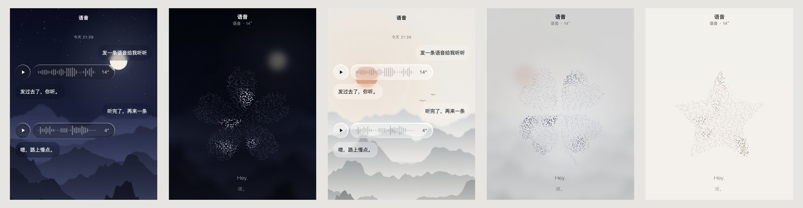

# 语音条

聊天里的一条语音消息：一颗播放珠子加一条波形。点一下播放；按住波形那条，它会浮起来，背后的聊天变糊，上面出现「原文 / 中文 | 演示」，下面是长按菜单。

点「演示」会进全屏：中间一个点和线连成的图形跟着声音流动，下面是逐字渐显的字幕，控件过两三秒自己退下去，方便录屏。



纯原生 JS ＋ CSS，没有依赖。玻璃皮要加一份 `liquid-core.js`（WebGL2 液态玻璃），其他皮不用。

## 怎么打开

```bash
# 在这个文件夹里
python3 -m http.server 8000
# 打开 http://localhost:8000/demo.html
```

上面一排切皮肤（纸 / 夜色 / 玻璃黑 / 玻璃白），第二排切演示里的图形。演示页里没有真声音，按估出来的时长走。

## 装进你的页面

```html
<link rel="stylesheet" href="voice-note.css">
<script src="liquid-core.js"></script>   <!-- 只有玻璃皮要 -->
<script src="voice-note.js"></script>
```

然后在聊天列表里放占位，它会自己长成语音条：

```js
list.innerHTML += VoiceNote.html({
  id: 'msg-42',
  en: '「soft, warm」Hey. 「small laugh」You found the button.',
  zh: '嘿。你找到这个按钮啦。',
  audio_url: '/tts/msg-42.mp3'
});
// 或者要一个元素：list.append(VoiceNote.render({...}))
```

列表用 `innerHTML` 整个重建也没关系：同一个 `id` 会接回同一个实例，播放到哪、字开没开都还在。

### 占位的数据

| 字段 | 必须 | 意思 |
|---|---|---|
| `id` | 建议给 | 认实例用；真波形也按它存在 localStorage |
| `en` | ✓ | 原文。「」或 [ ] 里是写给语音模型的神态，界面上不显示，只用来估这一段说得多轻多重。只有中文就把中文放这里 |
| `zh` | | 翻译，按句子对到原文上 |
| `audio_url` / `audio` | | 音频地址。没有就按字数估时长 |
| `duration` | | 秒。有真音频时以音频为准 |
| `time` | | 显示在演示页顶上 |

### 页面要有的颜色

`voice-note.css` 不自己定颜色，吃页面上这组 CSS 变量：

`--bg` `--card` `--card2` `--ink` `--sub` `--hint` `--line` `--accent` `--accent-soft` `--shadow` `--shadow-lift`

`demo.html` 开头有四套现成的值（纸、夜色、玻璃黑、玻璃白），照抄或者换成你自己的。皮肤靠 `<html>` 上的属性切：

| 属性 | 值 |
|---|---|
| `data-theme` | `light` / `dark` |
| `data-skin` | 不写＝纸；`liquid` 玻璃。其他皮也行：图形的颜色会从你的 `--ink` / `--hint` / `--accent` 现算 |
| `data-glasstone` | 玻璃皮才用：`dark` / `light` |

## `VoiceNote.config({...})`

| 键 | 默认 | 意思 |
|---|---|---|
| `shape` | `'star'` | 演示里的图形，见下面 |
| `audio(d)` | `d.audio \|\| d.audio_url` | 返回地址、`Promise<地址>` 或 `null` |
| `onAction(key, d, note)` | — | 长按菜单点了什么：`star` 收藏 / `copy` 复制 / `quote` 引用 / `multi` 多选 / `redo` 重说 / `hide` 藏起来。复制组件自己做了（复制的是去掉神态的原文＋中文），其他的接到你自己的功能上 |
| `menu` | 上面那六项 | 换成你自己的菜单 |
| `title` / `sub(d)` | `'语音'` / `语音 · 时间` | 演示页顶上那两行 |
| `scope(el)` | 最近的 `[data-vn-scope]`，没有就最近的滚动容器 | 浮起来时哪些东西要变糊 |
| `blurToo` | `''` | 还要一起糊的选择器，比如顶栏、输入框 |
| `stage()` | 页面上那块 `<liquid-stage>` | 玻璃皮用。全屏演示里那块画布的配方（`lobes`、`saturate`…）照抄它的 |
| `wallpaper(tone)` | 跟 `stage()` 同一张 | 演示页玻璃皮的底图 |
| `container()` | `body` | 演示页挂在哪 |
| `zIndex` | `9000` | 演示页的层级 |

其他方法：`VoiceNote.demo(d)` 直接打开演示，`VoiceNote.stop()` 停下并关掉演示，`VoiceNote.parse(en, zh)` 拆句对齐。

## 演示里的图形

| `shape` | |
|---|---|
| `'star'` | 星星 |
| `'flower'` | 小花，五瓣，瓣尖有个小缺口 |
| `'clover'` | 四叶草 |
| `'sprout'` | 嫩芽 |

想换成自己的形状，给一条 SVG 路径，画在 512×512 里：

```js
VoiceNote.config({ shape: { d: 'M256 40 L470 470 L42 470 Z', cx: 256, cy: 320 } });
```

`cx` / `cy` 是流动往外漂的起点，不给就用图形的重心。图形不描边：在形状里撒约两千个点，再把相近的点连起来，连线中途出了形状就不连，所以瓣和瓣之间的缝会自己空出来。随便一个图标的路径都能直接用，留意图标本身的授权就行。

## 设计上的几条

改之前先看这里，每一条都是试过别的写法以后定下来的。

| | |
|---|---|
| 波形 | 不跳。静止的形状就是这条语音每一段有多响，播放时只有一道进度从左往右扫过去 |
| 长按 | 只有波形那条浮起来，珠子和下面的字原地不动。背后是糊，不压暗 |
| 纸和玻璃 | 纸那一族是一个气泡（珠子和波形在一条里）；玻璃皮是两块（珠子＋胶囊） |
| 神态 | 「」和 [ ] 里的字界面上一律不显示，送去合成的仍然是带神态的原文 |
| 图形整体 | 不放大缩小。动的只有里面：随机的、从里往外的渐隐渐显，像水 |
| 流速 | 跟着声音有快有慢，说得越满，流到的那片越大 |
| 手感 | 像丝绸，不像硅胶：可以变形，但不会一下鼓起来又弹回去。形变幅度只跟很慢的包络走，每个点的位置和亮度都带一点惯性 |
| 播完 | 一秒内静下来，真的停住 |
| 字幕 | 细体、小一点；逐字渐显，前沿是一段软的渐变，不一个词一个词弹出来 |

## 调好的数

| 量 | 值 | 在哪 |
|---|---|---|
| 长按判定 | 600ms，手指移动超过 8px 取消 | `wire()` |
| 按住陷下去 | scale 0.955，弹簧 response 0.6 / damping 1 | `drive()` |
| 浮起 | scale 1.05，response 0.42 / damping 0.62（带一点回弹） | `openMenu()` |
| 放回 | scale 1，response 0.34 / damping 1（不过冲） | `closeMenu()` |
| 背后退远 | blur 4.5px、opacity .58，进 .34s / 出 .24s；玻璃皮的地面再糊 0.30 | `.vn-focus` / `groundTo()` |
| 字往下撑开 | 开：高度 0 → 全高 .32s；换段落：滑到新高度（变矮 .22s）；收：一下收 | `unfold()` |
| 静止波形 | 31 根；每段 0.25×峰值 ＋ 0.75×RMS；高度 0.07 ＋ 0.93×v^1.8 | `peaksFrom()` |
| 撒点 | 512² 里抖动网格 7.4px | `buildLeaf()` |
| 主场时钟 | `L × (0.9 + 1.1·V^1.1)`：一直在流，说话时最多 2 倍 | `drawLeaf()` |
| 重点色时钟 | `L × (1.4 + 1.2·V)` | `drawLeaf()` |
| 亮区门槛 | `0.14 − 0.40·A` | `drawLeaf()` |
| 惯性 | 位置 0.3s、亮度 0.2s 追过去。丝绸感就是这两个数 | `drawLeaf()` |
| 包络 | V 起 0.3s / 落 0.7s；A 起 0.55s / 落 1.1s；L 起 0.7s / 落 1.0s | `DEMO.frame()` |
| 字幕 | 每个字 0.45s 浮出；英文 16px / 300，中文 13px / 300 | `buildSubs()` |
| 控件退下 | 播放中 2.8s 没碰屏幕 | `DEMO.frame()` |

## 踩过的坑

1. **`[hidden]` 被 `display:flex` 压过去。** CSS 开头那条 `.vn [hidden]{display:none!important}` 别删。
2. **负的 dt。** rAF 的时间戳可能比 `performance.now()` 早一帧，第一帧 dt 是负的，包络会炸。所有 dt 都 `max(0, …)`。
3. **形变幅度跟着音节走就成了硅胶。** 幅度只接慢包络 A，别把 V 接回去。
4. **iOS 只认手势里的第一次 `play()`。** 要现合成的那条，点下去先拿一段静音把 `<audio>` 解锁，合成回来再放。
5. **`audio.src` 读回来是绝对地址**，跟相对地址比永远不等，会每次重载。播放器自己记一份地址。
6. **老 Safari 的 `decodeAudioData` 只认回调写法。** 已经包好了。
7. **演示页的玻璃用 `data-vn-glass`。** 写成 `data-glass` 会被页面那块大画布也算进去，白占一帧最多 14 块的玻璃名额。
8. **同屏语音条很多时**，每条占 2 块玻璃（字开着再 +1）。超出 14 块的那几条会没有玻璃，把远处的降成 CSS 料（`data-nogl`），别去加上限。

## 文件

| 文件 | 管什么 |
|---|---|
| `voice-note.js` | 本体，对外只有 `window.VoiceNote` |
| `voice-note.css` | 样式 |
| `liquid-core.js` | 液态玻璃（WebGL2），玻璃皮才要 |
| `demo.html` | 演示页 |
| `wall-dark.jpg` / `wall-light.jpg` | 玻璃皮的两张底图（月夜、晨雾），代码画的 |

## 致谢

- 长按菜单的图标：[Tabler Icons](https://tabler.io/icons)（MIT，Copyright © 2020-2024 Paweł Kuna）
- simplex 噪声：Stefan Gustavson 的公开实现

## 协议

跟整个仓库一样：[AGPL-3.0](../../LICENSE)，商用可以另外授权，见 [COMMERCIAL.md](../../COMMERCIAL.md)。
