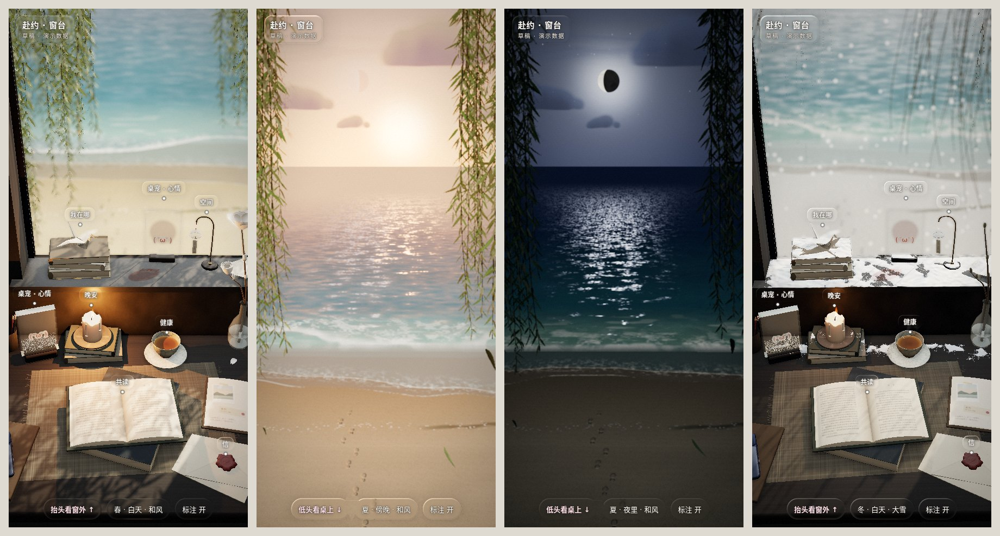

# 赴约 · 窗台

一张靠着窗的书桌，是一个**手机竖屏的 3D 网页**（three.js / WebGL）。窗开着，窗外是海和沙滩，两边垂着柳条；桌上每样东西都对应一个功能，点一下镜头就推过去。

**全部是用代码画出来的**：木纹、布纹、书页、沙子、海浪、云、月亮……没有用任何 AI 生成的图片或模型，也没有用别人的素材。



---

## 怎么打开

```bash
# 在这个文件夹里起一个本地服务器（浏览器不让直接用 file:// 读模型文件）
python3 -m http.server 8000
# 然后打开 http://localhost:8000
```

- 也可以直接双击 `index.html`：能看，只是 Blender 做的几件家具（电脑、手机、书柜、小格架）会换成程序画的简版。
- 需要联网：three.js 从 jsDelivr 的 CDN 加载。
- 放到 GitHub Pages、Netlify、任何静态网页托管上都行，整个文件夹原样传上去。
- 手机上看最好。电脑上会摆成一只小手机，拉杆在手机外面右边。

## 怎么玩

| 手势 | 做什么 |
|---|---|
| 左右拖 | 像坐在转椅上转，看桌子左边、右边 |
| 上滑 / 点「抬头看窗外」 | 抬头看窗外 |
| 点桌上的东西 | 镜头推过去，下面冒出一张液态玻璃卡片，写着它对应什么 |
| 点空处 / 下滑 / 「退回」 | 回来 |
| 拉杆（电脑在右边；手机点底下那颗按钮） | 季节、天色、风、雨、雪、雷 |

## 里面有什么

### 窗外

| | 怎么做的 |
|---|---|
| **海** | 整片海和冲上沙滩的那层水只是一块平面，每个像素在显卡里现算：水色按深浅由青到蓝，越往海平线越反天光；浪按浅水波的规律走（波速 = √(g·水深)，越近岸越慢、越挤），一组一组来，沿岸一段高一段低；浪高到水深的八成就碎，从最高那段先碎、往两边撕开，碎了是一道往前推的白浪，后面拖着白沫；推到水边就接上冲上沙滩的薄水，退回去留下湿沙、水痕和慢慢破掉的沫 |
| **沙滩** | 滩肩 + 缓缓的前滩；最高潮线上一簇簇海草和碎贝壳；一串走向海边的脚印，走到浪冲得到的地方就被抹平 |
| **天** | 渐变 + 太阳低时海平线上一片暖光；积云顶亮底灰（贴图里一格存厚度、一格存“照没照到”）；夜里有星星和月亮，**月亮的圆缺跟着真实日期**，海面上拉出一条月光 |
| **柳条** | 两边垂下来像珠帘；两万多片窄长的柳叶，有小枝，叶背灰白、逆光透亮；**整片柳条跟着同一阵风摆**，越往下的柳梢越慢半拍 |
| **海鸥** | 隔一阵飞过两三只，沿弯弯的路飞，转弯侧倾，往上爬扇翅膀、平飞滑翔 |

### 天气和天色

- **天色默认跟着手机的时间走**：清晨、白天、傍晚、入夜慢慢混过去；太阳早上从左边升起，傍晚落在正前方偏右的海面上。
- **窗是开着的**：风大了柳条和纱帘一起扬起来；雨雪斜着飘进窗口，先打湿、积在窗台上，风最大时也就飘到桌子中间那一排（流麻牌那儿）。
- 淋湿是一粒粒水珠、会反光；积雪只积在朝上、头顶没东西挡着的地方，雪停了慢慢化。
- 打雷：先亮一下，远处海上劈一道闪电，过一两秒才听到雷声（要先在页面上点过一下才有声音，浏览器的规定）。
- 四季：柳叶春天嫩黄、夏天深绿、秋天转黄掉一半、冬天只剩柳条；春天飘柳絮，秋天落叶会从窗口飘进来。

### 桌上（每样东西对应一个功能）

| 东西 | 功能 | | 东西 | 功能 |
|---|---|---|---|---|
| 电脑（屏幕上在放歌） | 一起听 | | 一杯茶 | 健康 |
| 扣在本子上的手机 | 对话 | | 玉兰火漆的信 | 信 |
| 挂板上的便签 | 碎碎念 | | 书上的小木盒 | 玩具厅 |
| 挂历 | 在一起 | | 枫树盆景 | 彩蛋：去作者的 GitHub 主页 |
| 纸星星罐 | 梗库 | | 透卡、流麻牌 | 桌宠 · 心情 |
| 书上的蜡烛 | 晚安（点一下吹灭） | | 摊开的旅行手帐 | 出门走走 |
| 摊开的书 | 共读 | | 书上的千纸鹤 | 我在哪 |
| 窗台上的风铃架 | 空间（点一下会荡） | | | |

- **桌宠是颜文字**：窗台上的透卡和桌上的流麻牌里是同一个小家伙。点一下换表情；它也会跟着场景变（看书时、听歌时、夜里打盹）。想加表情，改 `src/js/13-desk-pet.js` 里的 `FACES`。想要一只会动的小螃蟹陪你写代码，可以去装 [clawd-on-desk](https://github.com/rullerzhou-afk/clawd-on-desk)，它是单独的桌面宠物。
- **流麻牌**：点一下整块跳起来翻个面，底下的闪粉一粒一粒往下流（是真的在算每一粒沙往哪落）。
- 画面：液态玻璃的标注和卡片（背后的东西被弯一弯、边上一圈亮线、色散）、景深、环境光遮蔽、调色。

## 文件

```
赴约-窗台/
├── index.html          打开它就行（由 src/ 拼出来的成品）
├── build.mjs           把 src/ 拼回 index.html：node build.mjs
├── src/
│   ├── index.template.html   样式和页面骨架，中间留一个 /*@@SCRIPT@@*/
│   └── js/                    场景脚本，按顺序拼起来（见下表）
├── models/             Blender 做的四件：电脑、手机、书柜、小格架（.gltf.json）
├── blender/            生成这些模型的 Python 脚本，和一个 .glb → .gltf.json 的小工具
├── 预览/               截图
├── CHANGELOG.md        每次更新改了什么
```

### src/js 里每一段管什么

| 文件 | 管什么 |
|---|---|
| `00-setup.js` | 引入 three.js、渲染器、画面尺寸（电脑上摆成小手机）、常量 |
| `01-materials-textures.js` | 材质；用代码现画的贴图（木纹、磨石、灰泥、亚麻、书页、釉面、布纹） |
| `02-room-window-curtain.js` | 墙、窗台、长桌、窗框、纱帘 |
| `03-sky-sea-beach.js` | 天、星星和月亮、沙滩、海和浪、云 |
| `04-willow.js` | 柳条和风 |
| `05-magnolia-geometry.js` | 玉兰的花瓣和花 |
| `06-model-loading-helpers.js` | 读模型、常用小工具 |
| `07-gulls.js` | 海鸥 |
| `08-desk-materials-furin-books.js` | 桌上共用的材质、风铃架、书 |
| `09-left-writing-corner.js` | 左边写字角：留言板、挂历、便签、小格架、星星罐、电脑、手机 |
| `10-middle-reading-tea.js` | 中间：蜡烛、桌布、摊开的书、茶、信 |
| `11-right-window-corner.js` | 右边：玉兰瓶、书柜、绿萝、玩具盒、旅行手帐、笔、便签本 |
| `12-windowsill.js` | 窗台：透卡和它的彩色影子、千纸鹤、流麻牌、枫树盆景、纸飞机 |
| `13-desk-pet.js` | 桌宠（颜文字） |
| `14-light-time-season.js` | 光、天色（跟着时间）、月相、季节 |
| `15-falling-leaves.js` | 柳叶、柳絮往下飘 |
| `16-weather.js` | 风、雨、雪、雷；淋湿和积雪 |
| `17-tags-camera-glass.js` | 每样东西的功能和镜头、液态玻璃、景深 |
| `18-input-sliders.js` | 手势、拉杆 |
| `19-frame-api.js` | 每一帧；给后端接的口 |

**改哪儿就打开哪个文件，改完 `node build.mjs`**（Node 18 以上，不用装任何依赖），再刷新页面。
为什么不拆成独立的模块：整个场景本来是一个模块，各段之间直接共用变量（scene、材质、天色……），按顺序拼回去最稳。

## 接后端

页面外面拿到数据以后调这几个就行：

```js
fuyue.setNotes(['…', '…', '…'])            // 留言板上的三张便签（最近三条碎碎念）
fuyue.setNowPlaying({title, artist, dur, pos, playing, lyrics: [{t: 秒, text}]})   // 电脑上一起听的歌
fuyue.setBookPage({left, right, title, pages: ['214', '215']})                    // 摊开的书翻到哪一页
fuyue.setSpace('最新一条动态里的一句话')     // 风铃的纸笺换字、荡一下
fuyue.setClock('2026-10-03T19:30:00')       // 用这个时间算天色；setClock(null) 回到手机时间
fuyue.setAuto(true)                         // 天色跟不跟着时间走
fuyue.setWeather({wind: .3, rain: 0, snow: 0, thunder: 0})   // 0~1
fuyue.setWeather({windMs: 5, rainMmH: 2, snowCmH: 0, thunder: false})   // 或者直接给天气预报的数
fuyue.setFootprints(true)                   // 沙滩上那串脚印
```

页面里的聊天、便签、手帐这些字都是**演示用的假数据**。

## 重新生成模型

```bash
blender -b -P blender/furniture.py -- bookcase  models/bookcase.glb
blender -b -P blender/furniture.py -- organizer models/organizer.glb
blender -b -P blender/laptop.py   -- models/laptop.glb
blender -b -P blender/phone.py    -- models/phone.glb
python3 blender/glb2json.py models/bookcase.glb models/bookcase.gltf.json   # 每个都转一下
```

装了 Python 版 Blender（`pip install bpy`）的话，把 `blender -b -P` 换成 `python3` 也行。
Blender 里只建了形状，材质只是几个名字（wood、back、gilt……）当占位；**颜色和纹理是网页里按名字换上的**，贴图也是代码现画的。单位：1 = 10 厘米。

## 致谢

- [three.js](https://threejs.org)（MIT 协议）

## 协议

跟整个仓库一样：[AGPL-3.0](../../LICENSE)，商用可以另外授权，见 [COMMERCIAL.md](../../COMMERCIAL.md)。
